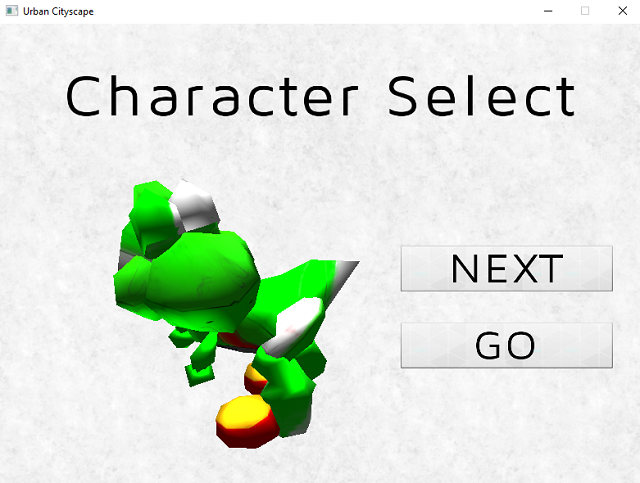
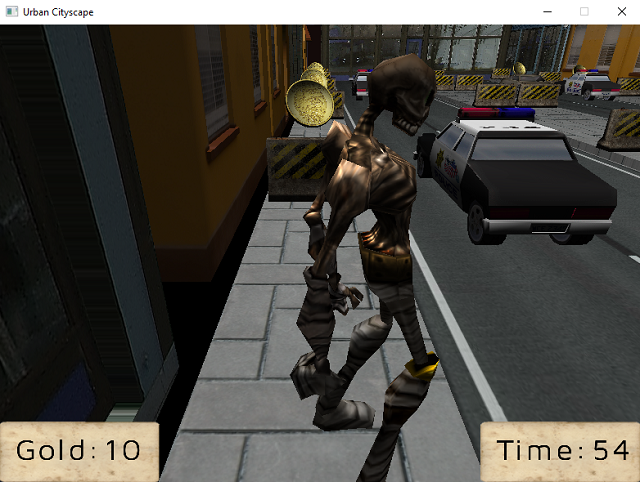
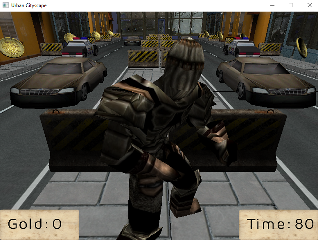

# Real-Time 3D Graphics - OpenGL

## Introduction

## Requirements

- Visual Studio 2013
- OpenGL Driver v3.3
- VC++ compiler

## Installation

Open the .sln file fo the project and compile the Coursework project. This action will first build the Zeno library which acts as a dependency for the main project.

## Screenshots

[YouTube Video](https://www.youtube.com/watch?v=_dTcpk8F0GU)

Screenshot 1

Screenshot 2

Screenshot 3

